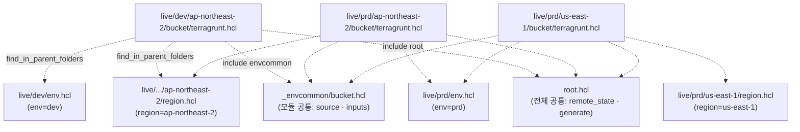

# 14. 멀티 환경 · 멀티 리전 폴더 구조

13편까지는 환경 둘(dev / prod) · 리전 하나였습니다. 환경이 셋(dev/stg/prd) 또는 리전이 둘 이상으로 늘어나면 폴더와 공통값을 어디에 어떻게 배치할지가 다시 문제입니다. 이번 편은 `live/<env>/<region>/<unit>` 구조 + `env.hcl` · `region.hcl` 메타 파일 + `_envcommon/` 패턴으로 정리합니다.

## 핵심 다이어그램



- **`root.hcl`** — 전체 공통. `remote_state` · `generate "provider"` · 전체 tags.
- **`_envcommon/<module>.hcl`** — 모듈 단위 공통. `terraform.source` · 모듈에 항상 들어가는 inputs.
- **`env.hcl`** — 환경 메타. 환경 이름, 계정 분리 시 profile/account_id.
- **`region.hcl`** — 리전 메타. 리전 이름.
- 각 unit 의 `terragrunt.hcl` 은 거의 비어 있습니다. 두 include + (필요 시) unit 별 override 뿐.

## 사전 준비

12·13편에서 만든 state 버킷을 그대로 씁니다. 없으면 다시 만듭니다.

```bash
export AWS_PROFILE=rosa-lab
ACCOUNT=$(aws sts get-caller-identity --query Account --output text)

aws s3api head-bucket --bucket "rosa-lab-tg-state-${ACCOUNT}" 2>/dev/null \
  || aws s3 mb "s3://rosa-lab-tg-state-${ACCOUNT}" --region ap-northeast-2
```

## 빠른 시작 — 폴더와 파일

```
/tmp/tf-lab-14/
├── root.hcl
├── _envcommon/
│   └── bucket.hcl
├── modules/
│   └── bucket/
│       ├── main.tf
│       ├── variables.tf
│       └── outputs.tf
└── live/
    ├── dev/
    │   ├── env.hcl
    │   └── ap-northeast-2/
    │       ├── region.hcl
    │       └── bucket/
    │           └── terragrunt.hcl
    └── prd/
        ├── env.hcl
        ├── ap-northeast-2/
        │   ├── region.hcl
        │   └── bucket/
        │       └── terragrunt.hcl
        └── us-east-1/
            ├── region.hcl
            └── bucket/
                └── terragrunt.hcl
```

```bash
mkdir -p /tmp/tf-lab-14/{modules/bucket,_envcommon}
mkdir -p /tmp/tf-lab-14/live/dev/ap-northeast-2/bucket
mkdir -p /tmp/tf-lab-14/live/prd/ap-northeast-2/bucket
mkdir -p /tmp/tf-lab-14/live/prd/us-east-1/bucket
cd /tmp/tf-lab-14
```

### `modules/bucket/`

```hcl
# modules/bucket/main.tf
terraform {
  required_providers {
    aws = {
      source  = "hashicorp/aws"
      version = "~> 5.0"
    }
  }
}

data "aws_caller_identity" "current" {}

resource "aws_s3_bucket" "this" {
  bucket        = "${var.prefix}-${var.env}-${var.region}-${data.aws_caller_identity.current.account_id}"
  force_destroy = true
  tags          = merge(var.tags, { Env = var.env, Region = var.region })
}

resource "aws_s3_bucket_versioning" "this" {
  count  = var.versioning_enabled ? 1 : 0
  bucket = aws_s3_bucket.this.id
  versioning_configuration {
    status = "Enabled"
  }
}
```

```hcl
# modules/bucket/variables.tf
variable "prefix" { type = string }
variable "env"    { type = string }
variable "region" { type = string }
variable "versioning_enabled" {
  type    = bool
  default = false
}
variable "tags" {
  type    = map(string)
  default = {}
}
```

```hcl
# modules/bucket/outputs.tf
output "bucket" { value = aws_s3_bucket.this.bucket }
```

### `root.hcl` — 전체 공통

```hcl
# root.hcl
locals {
  env_vars    = read_terragrunt_config(find_in_parent_folders("env.hcl"))
  region_vars = read_terragrunt_config(find_in_parent_folders("region.hcl"))

  env    = local.env_vars.locals.env
  region = local.region_vars.locals.region
}

remote_state {
  backend = "s3"
  config = {
    bucket       = "rosa-lab-tg-state-${get_aws_account_id()}"
    key          = "${path_relative_to_include()}/terraform.tfstate"
    region       = "ap-northeast-2"  # state 버킷은 한 리전에 고정
    profile      = "rosa-lab"
    use_lockfile = true
    encrypt      = true
  }
  generate = {
    path      = "backend.tf"
    if_exists = "overwrite_terragrunt"
  }
}

generate "provider" {
  path      = "provider.tf"
  if_exists = "overwrite_terragrunt"
  contents  = <<EOF
provider "aws" {
  region  = "${local.region}"
  profile = "rosa-lab"
}
EOF
}

inputs = {
  env    = local.env
  region = local.region
  tags = {
    Project = "rosa-hands-on"
    Edition = "terragrunt-14"
  }
}
```

`read_terragrunt_config(find_in_parent_folders("env.hcl"))` — unit 폴더에서 위로 올라가며 `env.hcl` 을 찾아 읽고, `locals` 블록을 노출합니다. `region.hcl` 도 같은 방식.

provider 의 `region` 이 `local.region` 으로 빠졌습니다. unit 이 `us-east-1` 폴더 안에 있으면 그 unit 의 캐시에는 `region = "us-east-1"` 짜리 provider.tf 가 박힙니다.

### `_envcommon/bucket.hcl` — 모듈 단위 공통

```hcl
# _envcommon/bucket.hcl
locals {
  env_vars           = read_terragrunt_config(find_in_parent_folders("env.hcl"))
  versioning_enabled = try(local.env_vars.locals.versioning_enabled, false)
}

terraform {
  source = "${dirname(find_in_parent_folders("root.hcl"))}/modules/bucket"
}

inputs = {
  prefix             = "rosa-lab-tg-14"
  versioning_enabled = local.versioning_enabled
}
```

`source` 는 `root.hcl` 의 부모(=프로젝트 루트) 기준으로 `modules/bucket` 을 가리킵니다. unit 폴더 깊이가 어떻게 바뀌어도 같은 식이 동작.

`locals` 가 일하는 자리입니다. `env.hcl` 에 `versioning_enabled` 가 있으면 그 값을, 없으면 `false` 를 inputs 로 넣습니다. `try()` 는 키가 없을 때 두 번째 인자로 fallback 하는 함수 — dev/stg 의 env.hcl 에 키를 안 적으면 자동으로 versioning off.

bucket 모듈의 정책(versioning · 암호화 · public block 등) 은 이 파일을 통해 env-wide 로 결정됩니다.

### `env.hcl` × 2

```hcl
# live/dev/env.hcl
locals {
  env = "dev"
}
```

```hcl
# live/prd/env.hcl
locals {
  env                = "prd"
  versioning_enabled = true
}
```

prd 의 env.hcl 에만 `versioning_enabled = true` 가 있습니다. `_envcommon/bucket.hcl` 의 `try()` 가 dev 에서는 false, prd 에서는 true 를 inputs 로 넘깁니다.

실무에선 env 마다 다른 AWS 계정이 표준입니다. 이 파일에 `account_id`, `profile`, alerting threshold 같은 환경 단위 값을 둡니다.

### `region.hcl` × 3

```hcl
# live/dev/ap-northeast-2/region.hcl
locals { region = "ap-northeast-2" }
```

```hcl
# live/prd/ap-northeast-2/region.hcl
locals { region = "ap-northeast-2" }
```

```hcl
# live/prd/us-east-1/region.hcl
locals { region = "us-east-1" }
```

### `terragrunt.hcl` × 3 — 세 unit 이 모두 동일

```hcl
# live/dev/ap-northeast-2/bucket/terragrunt.hcl
# live/prd/ap-northeast-2/bucket/terragrunt.hcl
# live/prd/us-east-1/bucket/terragrunt.hcl
include "root" {
  path = find_in_parent_folders("root.hcl")
}

include "envcommon" {
  path = "${dirname(find_in_parent_folders("root.hcl"))}/_envcommon/bucket.hcl"
}
```

세 파일이 완전히 같습니다. 환경·리전 차이는 `env.hcl` 과 `region.hcl` 이 모두 잡아주고, unit 의 `terragrunt.hcl` 은 두 include 만으로 끝.

## apply

```bash
cd /tmp/tf-lab-14/live
terragrunt run --all -- apply
```

세 unit 이 한 번에 apply 됩니다. unit 간 의존이 없으므로 병렬.

확인:

```bash
aws s3 ls --profile rosa-lab | grep rosa-lab-tg-14
# rosa-lab-tg-14-dev-ap-northeast-2-<account>
# rosa-lab-tg-14-prd-ap-northeast-2-<account>
# rosa-lab-tg-14-prd-us-east-1-<account>
```

```bash
aws s3 ls "s3://rosa-lab-tg-state-${ACCOUNT}/live/" --recursive --profile rosa-lab
# live/dev/ap-northeast-2/bucket/terraform.tfstate
# live/prd/ap-northeast-2/bucket/terraform.tfstate
# live/prd/us-east-1/bucket/terraform.tfstate
```

state key 가 unit 폴더 경로를 그대로 따라갑니다. `path_relative_to_include()` 한 함수가 모든 환경·리전 분기를 처리.

## 여기서 직접 확인할 수 있는 것

### unit 셋의 `terragrunt.hcl` 이 동일하다는 점

```bash
diff live/dev/ap-northeast-2/bucket/terragrunt.hcl \
     live/prd/us-east-1/bucket/terragrunt.hcl
# (출력 없음)
```

같은 unit 코드가 환경·리전을 가로질러 그대로 재사용됩니다. 환경별·리전별 차이는 부모 폴더의 메타 파일이 흡수.

### 생성된 backend.tf · provider.tf 보기

```bash
# prd/us-east-1/bucket 의 캐시
cat $(find live/prd/us-east-1/bucket/.terragrunt-cache -name provider.tf | head -1)
# provider "aws" {
#   region  = "us-east-1"
#   profile = "rosa-lab"
# }

cat $(find live/prd/us-east-1/bucket/.terragrunt-cache -name backend.tf | head -1)
# terraform {
#   backend "s3" {
#     bucket = "rosa-lab-tg-state-..."
#     key    = "live/prd/us-east-1/bucket/terraform.tfstate"
#     ...
#   }
# }
```

dev/ap-northeast-2 의 캐시를 같이 보면 `region` 과 `key` 만 다릅니다. 코드 한 곳에서 함수 두 개가 환경·리전 분기를 만들어냅니다.

### 환경 추가 — 폴더만 만들면 됩니다

stg 를 추가한다고 가정.

```bash
mkdir -p live/stg/ap-northeast-2/bucket
```

세 파일을 추가합니다.

```hcl
# live/stg/env.hcl
locals { env = "stg" }
```

```hcl
# live/stg/ap-northeast-2/region.hcl
locals { region = "ap-northeast-2" }
```

```hcl
# live/stg/ap-northeast-2/bucket/terragrunt.hcl
include "root" {
  path = find_in_parent_folders("root.hcl")
}
include "envcommon" {
  path = "${dirname(find_in_parent_folders("root.hcl"))}/_envcommon/bucket.hcl"
}
```

`root.hcl` · `_envcommon/bucket.hcl` · `modules/bucket/` 은 한 줄도 안 건드립니다.

```bash
cd live/stg/ap-northeast-2/bucket
terragrunt apply
# bucket = "rosa-lab-tg-14-stg-ap-northeast-2-<account>"
```

### 리전 추가도 폴더만

prd 에 eu-west-1 을 더한다면 `live/prd/eu-west-1/region.hcl` + `live/prd/eu-west-1/bucket/terragrunt.hcl` 두 파일이면 끝.

### env-wide 정책이 어떻게 전파됐는가 — versioning 확인

prd 의 env.hcl 한 줄(`versioning_enabled = true`) 이 prd 의 두 bucket 모두에 적용됩니다.

```bash
for env in dev prd; do
  for region in ap-northeast-2 us-east-1; do
    bucket="rosa-lab-tg-14-${env}-${region}-${ACCOUNT}"
    aws s3api head-bucket --bucket "$bucket" --profile rosa-lab >/dev/null 2>&1 || continue
    ver=$(aws s3api get-bucket-versioning --bucket "$bucket" \
      --query Status --output text --profile rosa-lab)
    echo "$bucket → versioning=${ver:-None}"
  done
done
# rosa-lab-tg-14-dev-ap-northeast-2-... → versioning=None
# rosa-lab-tg-14-prd-ap-northeast-2-... → versioning=Enabled
# rosa-lab-tg-14-prd-us-east-1-...      → versioning=Enabled
```

> zsh 에서 `$status` 는 마지막 종료코드를 담는 read-only 변수입니다. 일반 변수명으로 다른 이름(`ver` 등) 을 쓰세요. `head-bucket` 은 최근 AWS CLI 에서 stdout 으로도 응답을 찍어 `>/dev/null 2>&1` 로 양쪽 다 막습니다.

전파 경로:

```
live/prd/env.hcl
  └─ locals.versioning_enabled = true
       └─ _envcommon/bucket.hcl 의 read_terragrunt_config 가 읽음
            └─ inputs.versioning_enabled 로 모듈에 주입
                 └─ modules/bucket 의 count 가 1 → 리소스 생성
```

이 경로 위의 어디에서도 unit 의 `terragrunt.hcl` 은 건드리지 않습니다.

### 더 좁은 단위 override — unit 한 곳만 다르게

prd/us-east-1 의 bucket 만 정책을 따로 가져가야 한다면 unit 의 `terragrunt.hcl` 에서 inputs 를 override:

```hcl
# live/prd/us-east-1/bucket/terragrunt.hcl
include "root" {
  path = find_in_parent_folders("root.hcl")
}
include "envcommon" {
  path = "${dirname(find_in_parent_folders("root.hcl"))}/_envcommon/bucket.hcl"
}

inputs = {
  versioning_enabled = false  # 이 unit 만 예외
}
```

같은 키를 양쪽에서 정의하면 child(unit) 가 envcommon 을 이깁니다. 정책 단일 출처는 env.hcl, 예외는 unit — 둘의 역할 분리가 멀티 환경 구조의 핵심.

### 환경별 다른 account · profile

`env.hcl` 에 profile 을 두면 됩니다.

```hcl
# live/prd/env.hcl
locals {
  env     = "prd"
  profile = "rosa-lab-prd"
}
```

```hcl
# live/dev/env.hcl
locals {
  env     = "dev"
  profile = "rosa-lab-dev"
}
```

root.hcl 의 `remote_state.config.profile` 과 `generate "provider"` 의 profile 을 `local.env_vars.locals.profile` 로 바꾸면 환경마다 다른 자격증명으로 init/apply 됩니다. state 버킷도 환경별 계정 안에 두는 패턴이 일반적.

## destroy 와 정리

```bash
cd /tmp/tf-lab-14/live
terragrunt run --all -- destroy
```

state 버킷은 13편과 공유 — 다음 편(15편) 에서 PR 기반 워크플로를 다룰 때도 같은 버킷을 씁니다. 이번 편 끝에 정리하려면:

```bash
ACCOUNT=$(aws sts get-caller-identity --query Account --output text)
aws s3 rb "s3://rosa-lab-tg-state-${ACCOUNT}" --force
```

### 실습 폴더 정리

```bash
cd /tmp && rm -rf tf-lab-14
```
