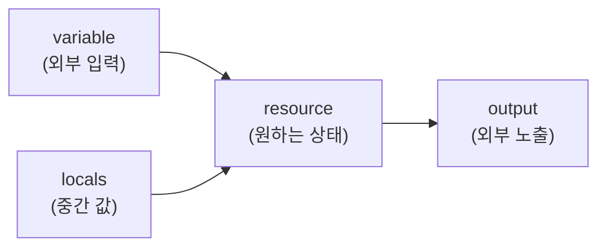

# 2. HCL 한 권

HCL의 다섯 가지 도구(variable · output · locals · count · for_each)를 1편 코드에 하나씩 적용하며, 더 깔끔하고 재사용 가능한 형태로 다듬어 갑니다.

## 핵심 다이어그램



- **variable** — 외부에서 코드 안으로 값을 주입하는 입력
- **output** — 코드 밖으로 결과를 노출
- **locals** — 코드 안에서 중간 값에 이름을 붙임
- **count** — 같은 리소스를 N개
- **for_each** — set/map의 각 항목마다 리소스 1개

## 빠른 시작

새 작업 폴더에서 1편의 main.tf와 같은 코드로 시작합니다.

```bash
mkdir -p /tmp/tf-lab-2 && cd /tmp/tf-lab-2
```

```hcl
# main.tf
terraform {
  required_providers {
    local = {
      source  = "hashicorp/local"
      version = "2.9.0"
    }
    random = {
      source  = "hashicorp/random"
      version = "3.9.0"
    }
  }
}

resource "random_pet" "name" {
  length = 2
}

resource "local_file" "hello" {
  filename = "${path.module}/hello.txt"
  content  = "안녕, ${random_pet.name.id}\n"
}
```

```bash
terraform init
terraform apply
#   Enter a value: yes
```

이제 이 코드에 HCL 도구를 하나씩 더해갑니다.

## 여기서 직접 확인할 수 있는 것

### `variable` 로 값을 밖으로 빼냅니다

`random_pet.name.length = 2` 는 코드에 하드코딩되어 있습니다. 이 값을 변수로 빼냅니다.

```hcl
# variables.tf (새 파일)
variable "pet_length" {
  type        = number
  default     = 2
  description = "random_pet 의 단어 수"
}
```

```hcl
# main.tf — random_pet 부분만 수정
resource "random_pet" "name" {
  length = var.pet_length
}
```

```bash
terraform plan
# No changes. Your infrastructure matches the configuration.
```

`default` 가 2 이므로 동작은 같습니다. 명령줄에서 다른 값을 줄 수 있습니다.

```bash
terraform plan -var="pet_length=5"
# random_pet.name must be replaced
# -/+ resource "random_pet" "name" {
#       ~ length = 2 -> 5 # forces replacement
#     }
```

변수에 값을 주는 방법은 네 가지입니다.

| 방법 | 예 |
|---|---|
| CLI 플래그 | `terraform apply -var="pet_length=5"` |
| 환경변수 | `export TF_VAR_pet_length=5` |
| `terraform.tfvars` 파일 | `pet_length = 5` (apply 시 자동 적용) |
| 대화형 | `default` 가 없는 변수는 plan/apply 때 직접 물어봄 |

`variable` 블록에는 `type` (string · number · bool · list · map · set · object), `description`, `default`, `validation` 등을 붙일 수 있습니다.

### `output` 으로 결과를 노출합니다

apply 결과의 특정 값을 외부에 보여주려면 `output` 을 선언합니다.

```hcl
# outputs.tf (새 파일)
output "pet_name" {
  value       = random_pet.name.id
  description = "랜덤으로 정해진 펫 이름"
}

output "hello_file" {
  value = local_file.hello.filename
}
```

```bash
terraform apply
#   Enter a value: yes
#
# Apply complete! Resources: 0 added, 0 changed, 0 destroyed.
#
# Outputs:
#
# hello_file = "./hello.txt"
# pet_name = "happy-otter"
```

`terraform output` 으로 다시 볼 수 있고, `-raw` 로 따옴표 없이 값만 뽑을 수도 있습니다.

```bash
terraform output
# hello_file = "./hello.txt"
# pet_name = "happy-otter"

terraform output -raw pet_name
# happy-otter
```

`-raw` 는 다른 명령에 파이프하기 좋습니다 (예: `echo "Hello, $(terraform output -raw pet_name)"`).

### `locals` 로 중간 값에 이름을 붙입니다

여러 곳에서 같은 표현을 쓰거나, 복잡한 계산에 이름을 붙이고 싶을 때 `locals` 를 씁니다.

```hcl
# main.tf 상단에 추가
locals {
  output_dir = "${path.module}/out"
  greeting   = "안녕"
}
```

```hcl
# local_file 부분 수정
resource "local_file" "hello" {
  filename = "${local.output_dir}/hello.txt"
  content  = "${local.greeting}, ${random_pet.name.id}\n"
}
```

```bash
terraform apply
# local_file.hello must be replaced  (filename 변경)
#   Enter a value: yes

ls out/
# hello.txt

cat out/hello.txt
# 안녕, happy-otter
```

`variable` 과 달리 `locals` 는 외부에서 값을 주입할 수 없습니다. 코드 안에서만 정의·사용합니다.

### `count` 로 여러 개 만듭니다

같은 리소스 N개가 필요하면 `count` 를 씁니다.

```hcl
# main.tf 에 추가
resource "random_pet" "tags" {
  count  = 3
  length = 2
}
```

```hcl
# outputs.tf 에 추가
output "tags" {
  value = random_pet.tags[*].id
}
```

`[*]` 는 splat expression. 리스트의 모든 요소에서 `.id` 를 뽑아 다시 리스트로 만듭니다.

```bash
terraform apply
# random_pet.tags[0]: Creating...
# random_pet.tags[1]: Creating...
# random_pet.tags[2]: Creating...

terraform output tags
# tags = [
#   "modest-koi",
#   "able-snake",
#   "merry-dolphin",
# ]
```

**`count` 의 함정** — 중간 항목을 빼면 인덱스가 밀려서 뒤 항목들이 모두 destroy/create 됩니다. 항목이 자주 추가·삭제되는 컬렉션에는 `for_each` 가 더 안전합니다.

### `for_each` 로 컬렉션마다 만듭니다

set 이나 map 의 각 항목마다 리소스 1개씩 만들 때 `for_each` 를 씁니다.

```hcl
# variables.tf 에 추가
variable "names" {
  type        = set(string)
  default     = ["alice", "bob", "charlie"]
  description = "각자에게 인사 파일을 만들 이름 집합"
}
```

```hcl
# main.tf 에 추가
resource "local_file" "greetings" {
  for_each = var.names
  filename = "${local.output_dir}/${each.key}.txt"
  content  = "${local.greeting}, ${each.key}!\n"
}
```

set에서 `each.key` 는 항목 자체입니다 (map이면 `each.key` 가 키, `each.value` 가 값).

```bash
terraform apply
# local_file.greetings["alice"]: Creating...
# local_file.greetings["bob"]: Creating...
# local_file.greetings["charlie"]: Creating...

ls out/
# alice.txt  bob.txt  charlie.txt  hello.txt

cat out/bob.txt
# 안녕, bob!
```

각 리소스는 `local_file.greetings["alice"]` 처럼 **키로** 참조합니다 (count의 `[0]`/`[1]`/`[2]` 와 달리 항목이 추가·삭제되어도 안정적).

`names` 에서 "bob" 만 빼봅니다.

```hcl
variable "names" {
  default = ["alice", "charlie"]
}
```

```bash
terraform plan
#   # local_file.greetings["bob"] will be destroyed
#   - resource "local_file" "greetings" { ... }
#
# Plan: 0 to add, 0 to change, 1 to destroy.
```

"bob" 만 사라지고 다른 항목은 영향이 없습니다. count 였다면 인덱스가 밀려서 모든 파일이 재생성됐을 차이입니다.

### 실습 폴더 정리

```bash
terraform destroy
#   Enter a value: yes

cd ..
rm -rf /tmp/tf-lab-2
```
