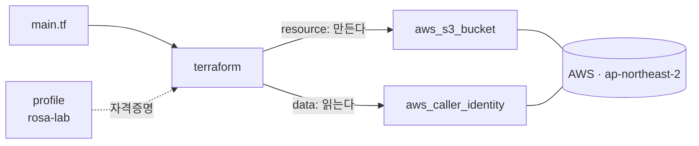

# 3. 처음 만나는 AWS

AWS에 처음 접속해 S3 버킷 하나를 띄우고, 외부 값을 읽어오는 `data` 도 함께 다룹니다.

## 핵심 다이어그램



- **aws provider** — Terraform이 AWS API를 호출하기 위한 플러그인
- **profile `rosa-lab`** — 0편에서 만든 자격증명을 가리킴
- **resource** — Terraform이 만들고 관리하는 AWS 리소스 (`aws_s3_bucket`)
- **data** — 외부에서 읽기만 하는 정보 (`aws_caller_identity`)

## 빠른 시작

```bash
mkdir -p /tmp/tf-lab-3 && cd /tmp/tf-lab-3
```

```hcl
# main.tf
terraform {
  required_providers {
    aws = {
      source  = "hashicorp/aws"
      version = "~> 5.0"
    }
  }
}

provider "aws" {
  region  = "ap-northeast-2"
  profile = "rosa-lab"
}

data "aws_caller_identity" "current" {}

resource "aws_s3_bucket" "lab" {
  bucket = "rosa-lab-tf-3-${data.aws_caller_identity.current.account_id}"

  tags = {
    Project = "rosa-hands-on"
    Edition = "terraform-3"
  }
}

output "bucket_name" {
  value = aws_s3_bucket.lab.bucket
}

output "caller" {
  value = data.aws_caller_identity.current.arn
}
```

```bash
terraform init
terraform apply
#   Enter a value: yes
```

## 여기서 직접 확인할 수 있는 것

### `provider "aws"` 는 자격증명을 어디서 가져오는가

provider 블록에는 `profile = "rosa-lab"` 한 줄만 적혀 있습니다. Terraform 은 이 줄을 보고 `~/.aws/credentials` 와 `~/.aws/config` 의 `[rosa-lab]` 섹션을 읽어 access key 를 가져옵니다.

profile 을 안 적으면 환경변수 `AWS_PROFILE`, 그것도 없으면 `AWS_ACCESS_KEY_ID` / `AWS_SECRET_ACCESS_KEY` 를 차례로 찾아봅니다. 모두 없으면 에러로 멈춥니다.

```bash
terraform output caller
# arn:aws:iam::123456789012:user/terraform-lab
```

`terraform-lab` 으로 호출되고 있는 게 확인됩니다.

### `data` 는 외부 상태를 코드로 끌어옵니다

`data "aws_caller_identity" "current" {}` 는 AWS 에 "지금 호출자가 누구인지" 묻고 그 답(`account_id`, `user_id`, `arn`)을 변수처럼 코드에서 쓸 수 있게 해줍니다.

- **resource** 는 Terraform 이 **만들고 관리**합니다 (create · update · delete).
- **data** 는 외부에서 **읽기만** 합니다. 다른 곳(콘솔, 다른 Terraform, 누가 만들었든)에서 만들어진 정보를 가져와 씁니다.

이 편에서는 `data.aws_caller_identity.current.account_id` 를 버킷 이름에 끼워 넣어 전역 고유성을 확보합니다 (S3 버킷 이름은 전 세계에서 유일해야 합니다).

```bash
terraform output bucket_name
# rosa-lab-tf-3-123456789012
```

### S3 버킷이 실제로 만들어졌는지 확인합니다

Terraform 이 만든 게 진짜 AWS 에 올라갔는지 AWS CLI 로 봅니다.

```bash
aws s3 ls --profile rosa-lab
# 2026-06-17 15:30:00 rosa-lab-tf-3-123456789012

aws s3 ls "s3://$(terraform output -raw bucket_name)" --profile rosa-lab
# (비어 있음)
```

AWS 콘솔(`S3` → `Buckets`)에서도 같은 버킷이 보입니다.

### `terraform state show` 로 리소스 속성을 들여다봅니다

state 파일을 직접 열지 않고도 리소스의 모든 속성을 정돈된 형태로 볼 수 있습니다.

```bash
terraform state show aws_s3_bucket.lab
# # aws_s3_bucket.lab:
# resource "aws_s3_bucket" "lab" {
#     arn                         = "arn:aws:s3:::rosa-lab-tf-3-..."
#     bucket                      = "rosa-lab-tf-3-..."
#     bucket_domain_name          = "rosa-lab-tf-3-....s3.amazonaws.com"
#     hosted_zone_id              = "Z3W03P7JVZ4VQX"
#     id                          = "rosa-lab-tf-3-..."
#     region                      = "ap-northeast-2"
#     tags                        = {
#         "Edition" = "terraform-3"
#         "Project" = "rosa-hands-on"
#     }
#     ...
# }
```

코드에는 `bucket` 과 `tags` 만 적었지만, AWS 가 자동으로 채워준 속성(`arn`, `bucket_domain_name`, `hosted_zone_id` 등)이 state 에 함께 들어옵니다.

data source 도 같은 방식으로 들여다볼 수 있습니다.

```bash
terraform state show data.aws_caller_identity.current
# # data.aws_caller_identity.current:
# data "aws_caller_identity" "current" {
#     account_id = "123456789012"
#     arn        = "arn:aws:iam::123456789012:user/terraform-lab"
#     id         = "123456789012"
#     user_id    = "AIDA..."
# }
```

### `terraform destroy` 로 정리합니다

AWS 리소스는 떠 있는 동안 비용이 누적될 수 있습니다. 실습이 끝나면 즉시 destroy 합니다.

```bash
terraform destroy
# ...
# Do you really want to destroy all resources?
#   Enter a value: yes
#
# aws_s3_bucket.lab: Destroying... [id=rosa-lab-tf-3-...]
# aws_s3_bucket.lab: Destruction complete after 1s
#
# Destroy complete! Resources: 1 destroyed.
```

확인:

```bash
aws s3 ls --profile rosa-lab | grep rosa-lab-tf-3
# (없음)
```

> 객체가 들어 있는 버킷은 그냥 destroy 로 지워지지 않습니다. `force_destroy = true` 옵션이나 객체를 먼저 비우는 절차가 필요합니다. 이 편은 빈 버킷이므로 그대로 destroy 됩니다.

### 실습 폴더 정리

```bash
cd ..
rm -rf /tmp/tf-lab-3
```

## 비용 습관

S3 빈 버킷 하나는 거의 0원이지만, EC2 · NAT Gateway 같은 리소스는 시간당 과금이 즉시 시작됩니다. 실습이 끝났는지 헷갈리는 채로 두면 며칠 만에 큰 청구서가 옵니다.

- **destroy 를 빠뜨리지 않습니다.** 매 실습이 끝나면 무조건 `terraform destroy`.
- **콘솔의 Cost Explorer / Billing** 을 가끔 확인합니다. 예상 외 항목이 있는지.
- **리전을 한 곳으로 통일**합니다. 다른 리전에 만든 리소스를 잊고 있기 쉽습니다.
- **태그를 일관되게 붙입니다.** 위 main.tf 의 `Project`, `Edition` 처럼 — 나중에 Cost Explorer 에서 태그별 비용을 가를 수 있습니다.
