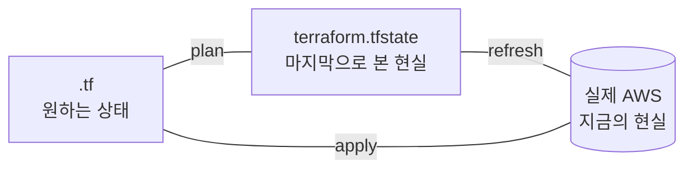

# 4. state 는 무엇이고 왜 골치인가

`terraform.tfstate` 가 무엇을 담고 있고, 왜 골치인지(drift · 동시성 · 유실 · 민감 정보) 차례로 확인합니다.

## 핵심 다이어그램



- **`.tf`** — 코드가 표현하는 "원하는 상태"
- **`terraform.tfstate`** — Terraform 이 마지막 apply 때 본 현실의 기록 ("마지막으로 본 현실")
- **실제 AWS** — Terraform 이 안 보는 사이에 변할 수 있는 "지금의 현실"
- **plan** 은 코드와 state 를 비교, **refresh** 는 state 를 현실에 맞춰 갱신, **apply** 는 코드대로 현실을 바꿉니다.
- **drift** — 코드 · state · 현실 셋이 어긋난 상태. 보통 콘솔이나 CLI 로 누가 손댄 결과.

## 빠른 시작

```bash
mkdir -p /tmp/tf-lab-4 && cd /tmp/tf-lab-4
```

```hcl
# main.tf
terraform {
  required_providers {
    aws = {
      source  = "hashicorp/aws"
      version = "~> 5.0"
    }
  }
}

provider "aws" {
  region  = "ap-northeast-2"
  profile = "rosa-lab"
}

data "aws_caller_identity" "current" {}

resource "aws_s3_bucket" "lab" {
  bucket = "rosa-lab-tf-4-${data.aws_caller_identity.current.account_id}"

  tags = {
    Project = "rosa-hands-on"
    Edition = "terraform-4"
  }
}

output "bucket_name" {
  value = aws_s3_bucket.lab.bucket
}
```

```bash
terraform init
terraform apply
#   Enter a value: yes
```

## 여기서 직접 확인할 수 있는 것

### state 가 정확히 무엇을 담고 있는가

state 파일 위쪽에는 메타데이터가, 그 아래 `resources` 배열에 모든 리소스의 속성이 들어갑니다.

```bash
head -7 terraform.tfstate
# {
#   "version": 4,
#   "terraform_version": "1.x.x",
#   "serial": 3,
#   "lineage": "abc-def-...",
#   "outputs": {
#     ...
```

각 필드의 역할:

- **`version`** — state 스키마 버전
- **`serial`** — apply 할 때마다 증가하는 카운터
- **`lineage`** — 이 state 의 고유 식별자 (init 시 생성). 다른 state 파일과 우연히 같은 이름이어도 구분 가능
- **`outputs`** — 선언된 output 들의 값
- **`resources`** (아래) — 각 리소스의 모든 속성 (apply 직후의 현실 그대로)

JSON 을 직접 펼쳐 보기보다 `terraform state` 명령으로 정돈된 형태를 보는 게 편합니다.

```bash
terraform state list
# data.aws_caller_identity.current
# aws_s3_bucket.lab

terraform state show aws_s3_bucket.lab | head -10
# # aws_s3_bucket.lab:
# resource "aws_s3_bucket" "lab" {
#     arn         = "arn:aws:s3:::rosa-lab-tf-4-..."
#     bucket      = "rosa-lab-tf-4-..."
#     ...
# }
```

> **주의** — state 에는 리소스에 들어 있는 민감한 값(예: RDS 비밀번호)이 **평문으로** 저장될 수 있습니다. 깃에 절대 커밋하지 말 것. `.gitignore` 에 `*.tfstate` 가 반드시 포함되어야 합니다.

### drift — 누군가 콘솔에서 리소스를 바꾸면

AWS CLI 로 콘솔 동작을 흉내 내 버킷에 태그 한 개를 추가합니다 (`put-bucket-tagging` 은 태그 전체를 덮어쓰므로 기존 태그도 같이 적습니다).

```bash
aws s3api put-bucket-tagging \
  --bucket "$(terraform output -raw bucket_name)" \
  --tagging 'TagSet=[{Key=Project,Value=rosa-hands-on},{Key=Edition,Value=terraform-4},{Key=Manual,Value=true}]' \
  --profile rosa-lab
```

이제 셋의 상태는 다음과 같이 어긋나 있습니다.

| | tags |
|---|---|
| `.tf` 코드 | Project · Edition |
| `terraform.tfstate` | Project · Edition |
| 실제 AWS | Project · Edition · **Manual** |

`terraform plan` 으로 어긋남을 확인합니다.

```bash
terraform plan
# aws_s3_bucket.lab: Refreshing state... [id=rosa-lab-tf-4-...]
#
# Note: Objects have changed outside of Terraform
#
# Terraform detected the following changes made outside of Terraform...
#
#   # aws_s3_bucket.lab has been changed
#   ~ resource "aws_s3_bucket" "lab" {
#       ~ tags = {
#         + "Manual" = "true"
#       }
#     }
#
# Terraform will perform the following actions:
#
#   # aws_s3_bucket.lab will be updated in-place
#   ~ resource "aws_s3_bucket" "lab" {
#       ~ tags = {
#         - "Manual" = "true"
#       }
#     }
#
# Plan: 0 to add, 1 to change, 0 to destroy.
```

plan 출력은 두 부분으로 나뉩니다.

1. **"Objects have changed outside of Terraform"** — refresh 가 발견한 drift (현실 → state 갱신).
2. **"will perform the following actions"** — apply 시 어떻게 reconcile 할지 (코드 → 현실).

Terraform 은 **코드가 진실**이라고 보므로, 그대로 apply 하면 콘솔에서 추가된 `Manual` 태그를 다시 제거합니다.

```bash
terraform apply
#   Enter a value: yes
# aws_s3_bucket.lab: Modifying...
# aws_s3_bucket.lab: Modifications complete
```

다시 코드 = state = 현실. drift 해소.

### state 를 현실에 맞추기 — `apply -refresh-only`

콘솔 변경이 의도적이었다면 코드 쪽을 현실에 맞춰야 합니다. 그러려면 state 부터 현실에 맞춰 갱신해야 합니다.

다시 drift 를 만듭니다.

```bash
aws s3api put-bucket-tagging \
  --bucket "$(terraform output -raw bucket_name)" \
  --tagging 'TagSet=[{Key=Project,Value=rosa-hands-on},{Key=Edition,Value=terraform-4},{Key=Manual,Value=true}]' \
  --profile rosa-lab
```

`-refresh-only` 옵션으로 plan 하면, state 만 갱신하는 계획이 나옵니다.

```bash
terraform plan -refresh-only
# Note: Objects have changed outside of Terraform
# ...
# This plan was generated using -refresh-only, so Terraform will not take any actions
# to undo these. Apply this plan to record the updated values in the Terraform state...
```

```bash
terraform apply -refresh-only
#   Enter a value: yes
# (state 만 업데이트, AWS 는 그대로)
```

이제 state 는 현실(태그 3개)에 맞춰졌습니다. 코드는 여전히 태그 2개. 그래서 다음 plan 은 — 이번엔 "state 에 있는 `Manual` 태그가 코드에 없으니 제거" — 다시 drift 처럼 동작합니다.

결국 코드 쪽을 현실에 맞추는 것이 답입니다.

```hcl
# main.tf - tags 수정
tags = {
  Project = "rosa-hands-on"
  Edition = "terraform-4"
  Manual  = "true"
}
```

```bash
terraform plan
# No changes. Your infrastructure matches the configuration.
```

세 점(코드 · state · 현실)이 모두 일치합니다.

### local state 의 한계

지금 state 는 노트북 위의 파일(`terraform.tfstate`) 하나입니다. 회사에서 쓰기 시작하면 곧 문제에 부딪힙니다.

- **동시성** — 두 사람이 같은 코드로 동시에 apply 하면 마지막 사람이 다른 사람의 변경을 덮어쓰거나, state 파일이 깨질 수 있습니다.
- **공유** — 노트북 A 에서 만든 state 를 노트북 B 가 볼 수 없습니다. B 가 다시 apply 하면 "이건 내가 만들 차례" 라며 똑같은 리소스를 또 만들거나, 이미 있는 이름과 충돌해 에러로 멈춥니다.
- **유실** — state 파일을 잃으면 Terraform 은 자기가 무엇을 관리 중인지 모릅니다. AWS 에는 리소스가 그대로 있지만 코드는 "처음부터 만들어야 한다" 고 판단.
- **이력** — state 는 마지막 상태만 갖고 있습니다. "지난 주의 state" 같은 건 없음.
- **민감 정보** — 평문 JSON. 노트북 · 백업 · USB 가 노출되면 그 안의 비밀번호도 같이 노출.

이 문제들을 풀기 위한 표준이 **remote backend** 입니다. state 파일을 S3 같은 공용 저장소에 두고 DynamoDB 로 lock 을 걸어 동시성을 막는 구성.

### `terraform destroy` 로 정리합니다

```bash
terraform destroy
#   Enter a value: yes
# aws_s3_bucket.lab: Destroying...
# Destroy complete! Resources: 1 destroyed.
```

확인:

```bash
aws s3 ls --profile rosa-lab | grep rosa-lab-tf-4
# (없음)
```

### 실습 폴더 정리

```bash
cd ..
rm -rf /tmp/tf-lab-4
```
