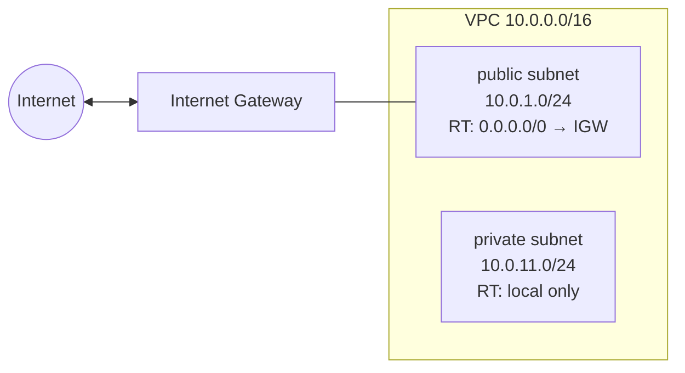

# 5. VPC 와 친구들

AWS 네트워킹을 코드로 짭니다. VPC · subnet · IGW · route table · security group 을 직접 선언해 네트워크 한 묶음을 구성합니다.

## 핵심 다이어그램



- **VPC** — 자기만의 네트워크 영역. CIDR 한 덩이(예: `10.0.0.0/16` = 65,536 IP).
- **Subnet** — VPC 안의 작은 구획. 한 AZ 에 묶입니다.
- **Internet Gateway (IGW)** — VPC 와 인터넷 사이의 다리.
- **Route Table** — subnet 의 라우팅 규칙. `0.0.0.0/0 → IGW` 가 있으면 그 subnet 은 **public**.
- **Security Group (SG)** — 리소스(EC2 · RDS 등)에 붙이는 stateful 방화벽.
- **NAT Gateway** — private subnet 이 외부로 나갈 때 쓰는 다리. **시간당 과금** 때문에 이 편에서는 만들지 않습니다.

## 빠른 시작

```bash
mkdir -p /tmp/tf-lab-5 && cd /tmp/tf-lab-5
```

```hcl
# main.tf
terraform {
  required_providers {
    aws = {
      source  = "hashicorp/aws"
      version = "~> 5.0"
    }
  }
}

provider "aws" {
  region  = "ap-northeast-2"
  profile = "rosa-lab"
}

locals {
  prefix = "rosa-lab-tf-5"

  tags = {
    Project = "rosa-hands-on"
    Edition = "terraform-5"
  }
}

# ─── VPC ─────────────────────────────
resource "aws_vpc" "main" {
  cidr_block           = "10.0.0.0/16"
  enable_dns_hostnames = true
  enable_dns_support   = true

  tags = merge(local.tags, { Name = "${local.prefix}-vpc" })
}

# ─── Internet Gateway ────────────────
resource "aws_internet_gateway" "igw" {
  vpc_id = aws_vpc.main.id

  tags = merge(local.tags, { Name = "${local.prefix}-igw" })
}

# ─── Subnets ────────────────────────
resource "aws_subnet" "public" {
  vpc_id                  = aws_vpc.main.id
  cidr_block              = "10.0.1.0/24"
  availability_zone       = "ap-northeast-2a"
  map_public_ip_on_launch = true

  tags = merge(local.tags, { Name = "${local.prefix}-public-2a" })
}

resource "aws_subnet" "private" {
  vpc_id            = aws_vpc.main.id
  cidr_block        = "10.0.11.0/24"
  availability_zone = "ap-northeast-2a"

  tags = merge(local.tags, { Name = "${local.prefix}-private-2a" })
}

# ─── Route Tables ───────────────────
resource "aws_route_table" "public" {
  vpc_id = aws_vpc.main.id

  route {
    cidr_block = "0.0.0.0/0"
    gateway_id = aws_internet_gateway.igw.id
  }

  tags = merge(local.tags, { Name = "${local.prefix}-rt-public" })
}

resource "aws_route_table_association" "public" {
  subnet_id      = aws_subnet.public.id
  route_table_id = aws_route_table.public.id
}

resource "aws_route_table" "private" {
  vpc_id = aws_vpc.main.id
  # 명시적 route 없음 — 로컬(VPC 내부) 라우트는 어느 RT 든 자동으로 있음

  tags = merge(local.tags, { Name = "${local.prefix}-rt-private" })
}

resource "aws_route_table_association" "private" {
  subnet_id      = aws_subnet.private.id
  route_table_id = aws_route_table.private.id
}

# ─── Security Group ─────────────────
resource "aws_security_group" "web" {
  name        = "${local.prefix}-web"
  description = "HTTP/HTTPS from anywhere"
  vpc_id      = aws_vpc.main.id

  ingress {
    description = "HTTP"
    from_port   = 80
    to_port     = 80
    protocol    = "tcp"
    cidr_blocks = ["0.0.0.0/0"]
  }

  ingress {
    description = "HTTPS"
    from_port   = 443
    to_port     = 443
    protocol    = "tcp"
    cidr_blocks = ["0.0.0.0/0"]
  }

  egress {
    description = "Allow all outbound"
    from_port   = 0
    to_port     = 0
    protocol    = "-1"
    cidr_blocks = ["0.0.0.0/0"]
  }

  tags = merge(local.tags, { Name = "${local.prefix}-sg-web" })
}

# ─── Outputs ────────────────────────
output "vpc_id" {
  value = aws_vpc.main.id
}

output "public_subnet_id" {
  value = aws_subnet.public.id
}

output "private_subnet_id" {
  value = aws_subnet.private.id
}

output "web_sg_id" {
  value = aws_security_group.web.id
}
```

```bash
terraform init
terraform apply
#   Enter a value: yes
# Apply complete! Resources: 9 added, 0 changed, 0 destroyed.
```

## 여기서 직접 확인할 수 있는 것

### VPC 와 subnet 의 관계

VPC 는 큰 CIDR 한 덩이(`10.0.0.0/16` = 65,536 IP), subnet 은 그 안의 작은 구획. 한 VPC 안에 여러 subnet 이 들어가고, 각 subnet 은 **하나의 AZ** 에 묶입니다.

```bash
aws ec2 describe-vpcs \
  --filters "Name=tag:Edition,Values=terraform-5" \
  --query 'Vpcs[].{Id:VpcId,Cidr:CidrBlock,Name:Tags[?Key==`Name`].Value | [0]}' \
  --profile rosa-lab
# [
#   {
#     "Id": "vpc-...",
#     "Cidr": "10.0.0.0/16",
#     "Name": "rosa-lab-tf-5-vpc"
#   }
# ]
```

```bash
aws ec2 describe-subnets \
  --filters "Name=vpc-id,Values=$(terraform output -raw vpc_id)" \
  --query 'Subnets[].{Id:SubnetId,Cidr:CidrBlock,AZ:AvailabilityZone,Name:Tags[?Key==`Name`].Value | [0]}' \
  --profile rosa-lab
```

### Route Table 이 subnet 을 public 으로 만듭니다

subnet 자체는 "public" 도 "private" 도 아닙니다. 거기 연결된 **route table** 에 `0.0.0.0/0 → IGW` 라우트가 있느냐로 갈립니다.

- **public RT** — `0.0.0.0/0 → IGW` 라우트가 있어, 연결된 subnet 의 인스턴스가 인터넷과 양방향 통신.
- **private RT** — 명시적 라우트 없음. 로컬(VPC 내부) 라우트는 어느 RT 에든 자동으로 들어가 있으므로, private subnet 은 VPC 안끼리만 통신.

```bash
aws ec2 describe-route-tables \
  --filters "Name=vpc-id,Values=$(terraform output -raw vpc_id)" \
  --query 'RouteTables[].{Id:RouteTableId,Routes:Routes[].{Dest:DestinationCidrBlock,Target:GatewayId},Assoc:Associations[].SubnetId}' \
  --profile rosa-lab
```

여기에 우리가 만들지 않은 **main route table** 도 보일 겁니다. VPC 생성 시 자동으로 따라오는 RT 인데, 우리는 어떤 subnet 도 거기 묶지 않았으므로 실제로 쓰이지 않습니다.

### Security Group — 리소스 단위 방화벽

route table 이 "어디로 갈 수 있느냐" 면, SG 는 "누가 들어오고 누가 나갈 수 있느냐" 입니다. EC2 인스턴스나 RDS 같은 리소스에 직접 붙입니다.

특징:

- **stateful** — ingress 로 들어온 연결의 응답은 egress 에 따로 적지 않아도 그대로 나갑니다.
- **whitelist** — 명시한 규칙만 허용, 나머지는 거부.
- **여러 개 동시에 붙일 수 있습니다** — 한 인스턴스에 SG 를 여러 개 묶으면 합집합으로 허용.

위 `aws_security_group.web` 은 80/443 ingress 와 모든 egress 를 허용합니다.

```bash
aws ec2 describe-security-groups \
  --group-ids "$(terraform output -raw web_sg_id)" \
  --query 'SecurityGroups[].{Name:GroupName,Ingress:IpPermissions[].{Port:FromPort,Cidrs:IpRanges[].CidrIp}}' \
  --profile rosa-lab
```

### 의존성은 자동으로 정리됩니다

`aws_internet_gateway.igw` 는 `vpc_id = aws_vpc.main.id` 로 VPC 를 참조합니다. 명시적인 `depends_on` 없이도 Terraform 은 이 참조를 보고 **VPC 가 먼저 만들어진 뒤 IGW** 가 만들어지도록 순서를 잡습니다. apply 로그를 보면 이 순서가 그대로 드러납니다.

destroy 도 역순으로 처리됩니다 — SG · RT · subnet · IGW · VPC.

### NAT Gateway 는 이 편에서는 만들지 않습니다

private subnet 이 외부(예: 패키지 다운로드)로 나가려면 NAT Gateway 가 필요합니다. 다만 비용이 무시 못할 정도입니다.

- 시간당 과금 (서울 기준 약 $0.045/h ≈ $33/month).
- 잠깐 띄워두는 것도 시간 단위로 누적.

참고용 코드 (적용하지 않습니다):

```hcl
# (참고용 — 이 편에서는 적용 안 함)
resource "aws_eip" "nat" {
  domain = "vpc"
}

resource "aws_nat_gateway" "nat" {
  allocation_id = aws_eip.nat.id
  subnet_id     = aws_subnet.public.id  # NAT 는 public subnet 에 둡니다
}

# private RT 에 NAT 라우트 추가
resource "aws_route" "private_default" {
  route_table_id         = aws_route_table.private.id
  destination_cidr_block = "0.0.0.0/0"
  nat_gateway_id         = aws_nat_gateway.nat.id
}
```

### `terraform destroy` 로 정리합니다

```bash
terraform destroy
#   Enter a value: yes
# (역순으로 — SG · RT · subnet · IGW · VPC)
# Destroy complete! Resources: 9 destroyed.
```

확인:

```bash
aws ec2 describe-vpcs \
  --filters "Name=tag:Edition,Values=terraform-5" \
  --query 'Vpcs[].VpcId' \
  --profile rosa-lab
# []
```

### 실습 폴더 정리

```bash
cd ..
rm -rf /tmp/tf-lab-5
```
