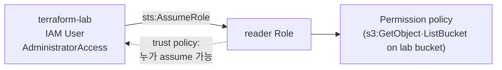

# 6. IAM

IAM 의 핵심 세 가지(policy · role · AssumeRole) 를 Terraform 으로 짜고, 임시 자격증명을 받아 최소 권한이 실제로 어떻게 작동하는지 확인합니다.

## 핵심 다이어그램



- **Policy** — 무엇을 할 수 있는지(Action · Resource · Effect) 적은 JSON 문서.
- **Role** — 자체 자격증명 없이, 누군가 assume 해서 잠시 사용하는 신분.
- **Trust policy** — 그 role 을 누가 assume 할 수 있는지 정한 정책 (`assume_role_policy`).
- **AssumeRole** — `sts:AssumeRole` API. 임시 access key + secret + session token 을 받아옵니다.
- **최소 권한** — 필요한 만큼만 허용. 권한이 좁을수록 사고 시 영향이 작아집니다.

## 빠른 시작

```bash
mkdir -p /tmp/tf-lab-6 && cd /tmp/tf-lab-6
```

```hcl
# main.tf
terraform {
  required_providers {
    aws = {
      source  = "hashicorp/aws"
      version = "~> 5.0"
    }
  }
}

provider "aws" {
  region  = "ap-northeast-2"
  profile = "rosa-lab"
}

data "aws_caller_identity" "current" {}

locals {
  prefix = "rosa-lab-tf-6"
  tags = {
    Project = "rosa-hands-on"
    Edition = "terraform-6"
  }
}

# ─── 데모용 S3 버킷 + 객체 한 개 ─────
resource "aws_s3_bucket" "lab" {
  bucket        = "${local.prefix}-${data.aws_caller_identity.current.account_id}"
  force_destroy = true  # 데모 후 destroy 가 막히지 않게
  tags          = local.tags
}

resource "aws_s3_object" "hello" {
  bucket  = aws_s3_bucket.lab.id
  key     = "hello.txt"
  content = "안녕, IAM\n"
}

# ─── Trust policy — terraform-lab 가 이 role 을 assume 가능 ──
data "aws_iam_policy_document" "trust" {
  statement {
    actions = ["sts:AssumeRole"]
    principals {
      type        = "AWS"
      identifiers = [data.aws_caller_identity.current.arn]
    }
  }
}

# ─── Permission policy — 위 버킷에 read 만 허용 ──
data "aws_iam_policy_document" "s3_read" {
  statement {
    effect = "Allow"
    actions = [
      "s3:GetObject",
      "s3:ListBucket",
    ]
    resources = [
      aws_s3_bucket.lab.arn,
      "${aws_s3_bucket.lab.arn}/*",
    ]
  }
}

# ─── Role · Policy · Attachment ─────
resource "aws_iam_role" "reader" {
  name               = "${local.prefix}-reader"
  assume_role_policy = data.aws_iam_policy_document.trust.json
  tags               = local.tags
}

resource "aws_iam_policy" "s3_read" {
  name   = "${local.prefix}-s3-read"
  policy = data.aws_iam_policy_document.s3_read.json
  tags   = local.tags
}

resource "aws_iam_role_policy_attachment" "reader_s3" {
  role       = aws_iam_role.reader.name
  policy_arn = aws_iam_policy.s3_read.arn
}

# ─── Outputs ────────────────────────
output "bucket_name" {
  value = aws_s3_bucket.lab.bucket
}

output "reader_role_arn" {
  value = aws_iam_role.reader.arn
}
```

```bash
terraform init
terraform apply
#   Enter a value: yes
# Apply complete! Resources: 5 added, 0 changed, 0 destroyed.
```

## 여기서 직접 확인할 수 있는 것

### `aws_iam_policy_document` — IAM JSON 을 HCL 로 짭니다

IAM 정책은 원래 JSON 입니다.

```json
{
  "Version": "2012-10-17",
  "Statement": [
    {
      "Effect": "Allow",
      "Action": ["s3:GetObject", "s3:ListBucket"],
      "Resource": ["arn:aws:s3:::...", "arn:aws:s3:::.../*"]
    }
  ]
}
```

Terraform 에서는 `data "aws_iam_policy_document"` 로 HCL 처럼 짤 수 있습니다.

```hcl
data "aws_iam_policy_document" "s3_read" {
  statement {
    effect = "Allow"
    actions   = ["s3:GetObject", "s3:ListBucket"]
    resources = [aws_s3_bucket.lab.arn, "${aws_s3_bucket.lab.arn}/*"]
  }
}
```

`.json` 어트리뷰트로 꺼내 쓰면 위 JSON 이 그대로 생성됩니다.

```hcl
resource "aws_iam_policy" "s3_read" {
  policy = data.aws_iam_policy_document.s3_read.json
}
```

장점은 ARN 같은 값을 다른 리소스에서 끌어와 쓸 수 있고, 오타·구조 오류가 plan 단계에서 잡힌다는 점.

### Trust policy 가 role 의 assume 가능자를 정합니다

Role 은 자체 자격증명이 없습니다. 누군가(IAM user · 다른 role · AWS 서비스)가 "이 role 입을게요" 하고 assume 해야 동작합니다. trust policy 가 누구를 허락할지 정합니다.

위 코드에서는 `terraform-lab` user 본인이 assume 할 수 있게 했습니다.

```bash
aws iam get-role \
  --role-name $(terraform output -raw reader_role_arn | awk -F/ '{print $NF}') \
  --query 'Role.AssumeRolePolicyDocument' \
  --profile rosa-lab
```

서비스(예: EC2 가 role 입기)나 다른 계정의 role 을 허용하려면 `principals` 의 `type` 과 `identifiers` 만 바꾸면 됩니다.

### `aws sts assume-role` 로 임시 자격증명을 받아옵니다

```bash
BUCKET=$(terraform output -raw bucket_name)
ROLE_ARN=$(terraform output -raw reader_role_arn)

# 평소(terraform-lab) 의 정체 확인
aws sts get-caller-identity --profile rosa-lab
# Arn: arn:aws:iam::...:user/terraform-lab

aws sts assume-role \
  --role-arn $ROLE_ARN \
  --role-session-name demo \
  --duration-seconds 900 \
  --profile rosa-lab
# {
#   "Credentials": {
#     "AccessKeyId":     "ASIA...",
#     "SecretAccessKey": "...",
#     "SessionToken":    "...",
#     "Expiration":      "..."
#   },
#   "AssumedRoleUser": {
#     "Arn": "arn:aws:sts::...:assumed-role/rosa-lab-tf-6-reader/demo"
#   }
# }
```

받은 세 값을 환경변수로 export 하면 그 셸은 이제 role 신분으로 동작합니다.

```bash
export AWS_ACCESS_KEY_ID=ASIA...
export AWS_SECRET_ACCESS_KEY=...
export AWS_SESSION_TOKEN=...

aws sts get-caller-identity
# Arn: arn:aws:sts::...:assumed-role/rosa-lab-tf-6-reader/demo
```

> 방금 만든 role 은 IAM 의 eventual consistency 때문에 1-2초 지연 후 안정적으로 assume 됩니다. 첫 시도가 `AccessDenied` 면 잠깐 후 재시도.

### 최소 권한 — 허용된 것만 됩니다

role 신분으로 행동을 두 가지 시도합니다.

```bash
# 허용된 행동: 버킷 내용 listing
aws s3 ls "s3://$BUCKET"
# 2026-... hello.txt

# 허용된 행동: 객체 가져오기
aws s3 cp "s3://$BUCKET/hello.txt" -
# 안녕, IAM

# 허용 안 된 행동: 모든 버킷 listing (s3:ListAllMyBuckets 필요)
aws s3 ls
# An error occurred (AccessDenied) when calling the ListBuckets operation
```

같은 셸이지만, 권한이 좁게 잡혀 있으니 정책에 없는 동작은 막힙니다.

원래 신분으로 돌아오려면 환경변수를 비웁니다.

```bash
unset AWS_ACCESS_KEY_ID AWS_SECRET_ACCESS_KEY AWS_SESSION_TOKEN
aws sts get-caller-identity --profile rosa-lab
# 다시 terraform-lab
```

### `terraform destroy` 로 정리합니다

```bash
terraform destroy
#   Enter a value: yes
# Destroy complete! Resources: 5 destroyed.
```

확인:

```bash
aws iam list-roles \
  --query "Roles[?contains(RoleName, 'rosa-lab-tf-6')].RoleName" \
  --profile rosa-lab
# []
```

### 실습 폴더 정리

```bash
cd ..
rm -rf /tmp/tf-lab-6
```
