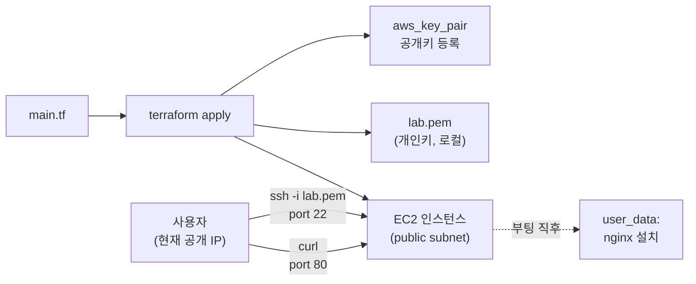

# 7. EC2 한 대 띄우고 SSH 까지

EC2 인스턴스 한 대를 Terraform 으로 띄우고, `user_data` 로 nginx 까지 자동 설치한 뒤, 내 IP 에서만 SSH 가 열린 그 인스턴스에 직접 들어가 봅니다.

## 핵심 다이어그램



- **AMI** — 어떤 OS · 디스크 이미지로 띄울지. `data "aws_ami"` 로 최신 Ubuntu 를 조회해 사용.
- **key pair** — `tls_private_key` 로 키 쌍 생성 → 공개키는 `aws_key_pair` 로 AWS 등록, 개인키는 `local_sensitive_file` 로 로컬 저장.
- **user_data** — 인스턴스 부팅 직후 한 번 실행되는 스크립트. cloud-init 이 root 권한으로 돌립니다.
- **SG (22 · 80)** — 현재 내 공개 IP 에서만 허용. `data "http"` 로 IP 를 자동 조회해 박습니다.

## 빠른 시작

```bash
mkdir -p /tmp/tf-lab-7 && cd /tmp/tf-lab-7
```

```hcl
# main.tf
terraform {
  required_providers {
    aws = {
      source  = "hashicorp/aws"
      version = "~> 5.0"
    }
    tls = {
      source  = "hashicorp/tls"
      version = "~> 4.0"
    }
    http = {
      source  = "hashicorp/http"
      version = "~> 3.4"
    }
    local = {
      source  = "hashicorp/local"
      version = "~> 2.5"
    }
  }
}

provider "aws" {
  region  = "ap-northeast-2"
  profile = "rosa-lab"
}

locals {
  prefix = "rosa-lab-tf-7"
  tags = {
    Project = "rosa-hands-on"
    Edition = "terraform-7"
  }
}

# ─── 내 공개 IP — SG ingress 에 사용 ───
data "http" "my_ip" {
  url = "https://checkip.amazonaws.com"
}

locals {
  my_ip_cidr = "${chomp(data.http.my_ip.response_body)}/32"
}

# ─── 최신 Ubuntu AMI 조회 ───────────
data "aws_ami" "ubuntu" {
  most_recent = true
  owners      = ["099720109477"] # Canonical

  filter {
    name   = "name"
    values = ["ubuntu/images/hvm-ssd-gp3/ubuntu-noble-24.04-amd64-server-*"]
  }
}

# ─── 미니 VPC (5편의 축약판) ─────────
resource "aws_vpc" "main" {
  cidr_block           = "10.0.0.0/16"
  enable_dns_hostnames = true
  enable_dns_support   = true
  tags = merge(local.tags, { Name = "${local.prefix}-vpc" })
}

resource "aws_internet_gateway" "igw" {
  vpc_id = aws_vpc.main.id
  tags   = merge(local.tags, { Name = "${local.prefix}-igw" })
}

resource "aws_subnet" "public" {
  vpc_id                  = aws_vpc.main.id
  cidr_block              = "10.0.1.0/24"
  availability_zone       = "ap-northeast-2a"
  map_public_ip_on_launch = true
  tags = merge(local.tags, { Name = "${local.prefix}-public-2a" })
}

resource "aws_route_table" "public" {
  vpc_id = aws_vpc.main.id
  route {
    cidr_block = "0.0.0.0/0"
    gateway_id = aws_internet_gateway.igw.id
  }
  tags = merge(local.tags, { Name = "${local.prefix}-rt-public" })
}

resource "aws_route_table_association" "public" {
  subnet_id      = aws_subnet.public.id
  route_table_id = aws_route_table.public.id
}

# ─── 키 쌍 (생성 + 등록 + 로컬 저장) ───
resource "tls_private_key" "ssh" {
  algorithm = "RSA"
  rsa_bits  = 4096
}

resource "aws_key_pair" "lab" {
  key_name   = "${local.prefix}-key"
  public_key = tls_private_key.ssh.public_key_openssh
  tags       = local.tags
}

resource "local_sensitive_file" "ssh_key" {
  filename        = "${path.module}/lab.pem"
  content         = tls_private_key.ssh.private_key_pem
  file_permission = "0600"
}

# ─── SSH(22) · HTTP(80) 을 내 IP 에서만 ──
resource "aws_security_group" "web" {
  name        = "${local.prefix}-web"
  description = "SSH/HTTP from my IP only"
  vpc_id      = aws_vpc.main.id

  ingress {
    description = "SSH"
    from_port   = 22
    to_port     = 22
    protocol    = "tcp"
    cidr_blocks = [local.my_ip_cidr]
  }

  ingress {
    description = "HTTP"
    from_port   = 80
    to_port     = 80
    protocol    = "tcp"
    cidr_blocks = [local.my_ip_cidr]
  }

  egress {
    description = "Allow all outbound"
    from_port   = 0
    to_port     = 0
    protocol    = "-1"
    cidr_blocks = ["0.0.0.0/0"]
  }

  tags = merge(local.tags, { Name = "${local.prefix}-sg-web" })
}

# ─── EC2 인스턴스 + user_data ─────────
resource "aws_instance" "web" {
  ami                    = data.aws_ami.ubuntu.id
  instance_type          = "t3.micro"
  subnet_id              = aws_subnet.public.id
  vpc_security_group_ids = [aws_security_group.web.id]
  key_name               = aws_key_pair.lab.key_name

  user_data = <<-EOF
    #!/bin/bash
    apt-get update
    apt-get install -y nginx
    echo "안녕, EC2! (host: $(hostname))" > /var/www/html/index.html
    systemctl enable --now nginx
  EOF

  tags = merge(local.tags, { Name = "${local.prefix}-web" })
}

output "public_ip" {
  value = aws_instance.web.public_ip
}

output "ssh_command" {
  value = "ssh -i ${local_sensitive_file.ssh_key.filename} ubuntu@${aws_instance.web.public_ip}"
}
```

```bash
terraform init
terraform apply
#   Enter a value: yes
# Apply complete! Resources: 10 added, 0 changed, 0 destroyed.
```

## 여기서 직접 확인할 수 있는 것

### `data "aws_ami"` 로 최신 Ubuntu 를 가져옵니다

AMI ID 는 region · 시점마다 다르고, 하드코딩하면 곧 낡습니다. data source 로 매번 최신을 조회합니다.

```bash
terraform state show data.aws_ami.ubuntu | head
# # data.aws_ami.ubuntu:
# data "aws_ami" "ubuntu" {
#     architecture       = "x86_64"
#     id                 = "ami-..."
#     name               = "ubuntu/images/hvm-ssd-gp3/ubuntu-noble-24.04-amd64-server-20..."
#     owner_id           = "099720109477"
#     ...
```

`owners` 는 Canonical (Ubuntu 제조사) 의 AWS account ID. `filter` 의 name 패턴이 노블 24.04 amd64 서버 이미지를 가리킵니다.

### `tls_private_key` + `aws_key_pair` — SSH 키 생성 + 등록

세 리소스가 짝을 이룹니다.

- `tls_private_key` — 노트북 위에서 키 쌍 생성 (로컬 계산, 외부 API 호출 없음).
- `aws_key_pair` — 그 공개키를 AWS 에 등록. EC2 가 부팅할 때 `~ubuntu/.ssh/authorized_keys` 에 박힙니다.
- `local_sensitive_file` — 개인키를 `lab.pem` 으로 저장. `sensitive` 변형은 plan 로그에 내용을 출력하지 않음 (보통의 `local_file` 은 출력함).

```bash
ls -la lab.pem
# -rw-------  ...  lab.pem
```

> 개인키는 `terraform.tfstate` 에도 저장됩니다 (평문). 학습이 끝나면 destroy 로 정리하고, 운영에서는 외부 시크릿 저장소(1Password · Vault · AWS Secrets Manager 등)를 사용합니다.

### `user_data` — 부팅 직후 한 번 실행되는 스크립트

EC2 가 처음 부팅할 때 cloud-init 이 user_data 의 내용을 root 권한으로 실행합니다. 위 코드는 nginx 설치 + 간단한 `index.html`.

`user_data` 는 인스턴스 자체의 속성. 바꾸면 인스턴스 재생성(force replacement) 이 일어납니다. 운영에서 자주 바꿀 일이라면 launch template + auto scaling 으로 분리하는 패턴이 표준.

### `data "http"` 로 내 IP 를 가져와 SG 에 지정합니다

SSH 포트(22) 를 `0.0.0.0/0` 으로 열면 누구나 들어옵니다. brute force 공격의 표적이 되기 쉽습니다. 그래서 **현재 내 공개 IP 에서만** 허용합니다.

```hcl
data "http" "my_ip" {
  url = "https://checkip.amazonaws.com"
}

locals {
  my_ip_cidr = "${chomp(data.http.my_ip.response_body)}/32"
}
```

집 · 카페 등으로 옮기면 IP 가 바뀌니 `terraform apply` 한 번 더 — SG ingress 가 새 IP 로 갱신됩니다.

### SSH 로 들어가 user_data 가 돈 흔적을 확인합니다

`terraform apply` 직후 EC2 는 "Running" 이지만, `user_data` 의 `apt-get install -y nginx` 가 끝나기까지 1-2분 걸립니다. 너무 일찍 curl 하면 빈 응답.

```bash
PUBLIC_IP=$(terraform output -raw public_ip)

# (1-2분 기다린 뒤) SSH 접속
ssh -i lab.pem ubuntu@$PUBLIC_IP
```

EC2 안에서:

```bash
hostname
# ip-10-0-1-...

# user_data 실행 로그
tail -20 /var/log/cloud-init-output.log

# nginx 동작 확인
systemctl status nginx
# active (running)
curl localhost
# 안녕, EC2! (host: ip-10-0-1-...)

exit
```

호스트로 돌아와 외부에서도 접근:

```bash
curl http://$PUBLIC_IP
# 안녕, EC2! (host: ip-10-0-1-...)
```

### `terraform destroy` — 잊지 말 것

EC2 는 떠 있는 동안 시간당 과금됩니다 (t3.micro 서울 기준 ~$0.0104/h). 한 시간이면 1센트지만 며칠 잊으면 누적되고, 추가로 EBS 볼륨 비용도 따라옵니다.

```bash
terraform destroy
#   Enter a value: yes
# (역순으로 — instance · SG · key pair · subnet · IGW · VPC · 로컬 .pem)
# Destroy complete! Resources: 10 destroyed.
```

확인:

```bash
aws ec2 describe-instances \
  --filters "Name=tag:Edition,Values=terraform-7" "Name=instance-state-name,Values=running,pending,stopped" \
  --query 'Reservations[].Instances[].InstanceId' \
  --profile rosa-lab
# []
```

### 실습 폴더 정리

```bash
cd ..
rm -rf /tmp/tf-lab-7
```
