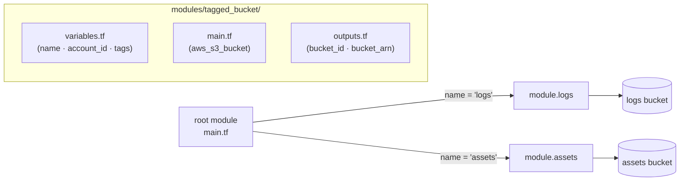

# 8. 모듈 — 무엇을 떼어내는가

같은 모양의 인프라가 반복될 때 그 묶음을 모듈로 떼어내 재사용합니다. input/output 으로 인터페이스를 잡고, 로컬 모듈을 만들고, 외부 모듈을 가져오는 패턴까지 다룹니다.

## 핵심 다이어그램



- **root module** — `terraform apply` 를 실행하는 폴더. 가장 바깥쪽.
- **child module** — 다른 모듈에서 불러 쓰는 `.tf` 묶음. 위에선 `modules/tagged_bucket/`.
- **`module` 블록** — 자식을 호출하는 문법. `source` 로 어디서 가져올지 지정, 나머지는 변수로 넘김.
- **input(variable) / output** — 모듈의 인터페이스. 외부에 노출할 것만 명시.

## 빠른 시작

폴더와 파일을 다음과 같이 만듭니다.

```
/tmp/tf-lab-8/
├── main.tf
├── outputs.tf
└── modules/
    └── tagged_bucket/
        ├── main.tf
        ├── variables.tf
        └── outputs.tf
```

```bash
mkdir -p /tmp/tf-lab-8/modules/tagged_bucket && cd /tmp/tf-lab-8
```

### 자식 모듈 — `modules/tagged_bucket/`

```hcl
# modules/tagged_bucket/variables.tf
variable "name" {
  type        = string
  description = "버킷 이름 suffix"
}

variable "account_id" {
  type        = string
  description = "전역 고유성을 위해 prefix 에 붙일 AWS account ID"
}

variable "tags" {
  type        = map(string)
  default     = {}
  description = "리소스에 붙일 태그"
}
```

```hcl
# modules/tagged_bucket/main.tf
resource "aws_s3_bucket" "this" {
  bucket        = "rosa-lab-tf-8-${var.account_id}-${var.name}"
  force_destroy = true
  tags          = var.tags
}
```

```hcl
# modules/tagged_bucket/outputs.tf
output "bucket_id" {
  value = aws_s3_bucket.this.id
}

output "bucket_arn" {
  value = aws_s3_bucket.this.arn
}
```

### Root module

```hcl
# main.tf
terraform {
  required_providers {
    aws = {
      source  = "hashicorp/aws"
      version = "~> 5.0"
    }
  }
}

provider "aws" {
  region  = "ap-northeast-2"
  profile = "rosa-lab"
}

data "aws_caller_identity" "current" {}

locals {
  tags = {
    Project = "rosa-hands-on"
    Edition = "terraform-8"
  }
}

module "logs" {
  source = "./modules/tagged_bucket"

  name       = "logs"
  account_id = data.aws_caller_identity.current.account_id
  tags       = local.tags
}

module "assets" {
  source = "./modules/tagged_bucket"

  name       = "assets"
  account_id = data.aws_caller_identity.current.account_id
  tags       = local.tags
}
```

```hcl
# outputs.tf
output "logs_bucket" {
  value = module.logs.bucket_id
}

output "assets_bucket" {
  value = module.assets.bucket_id
}
```

```bash
terraform init
terraform apply
#   Enter a value: yes
# Apply complete! Resources: 2 added, 0 changed, 0 destroyed.
```

## 여기서 직접 확인할 수 있는 것

### `terraform init` 은 모듈도 찾아 가져옵니다

```bash
terraform init
# Initializing the backend...
# Initializing modules...
# - assets in modules/tagged_bucket
# - logs in modules/tagged_bucket
# Initializing provider plugins...
# ...
# Terraform has been successfully initialized!
```

`.terraform/modules/modules.json` 에 어느 모듈이 어디서 왔는지 메타데이터가 들어갑니다.

```bash
cat .terraform/modules/modules.json
# {
#   "Modules": [
#     { "Key": "", "Source": "", "Dir": "." },
#     { "Key": "assets", "Source": "./modules/tagged_bucket", "Dir": "modules/tagged_bucket" },
#     { "Key": "logs",   "Source": "./modules/tagged_bucket", "Dir": "modules/tagged_bucket" }
#   ]
# }
```

로컬 모듈은 그대로 디렉토리를 가리키지만, git · 레지스트리 모듈은 init 시점에 `.terraform/modules/<key>/` 로 다운로드됩니다.

### 같은 모듈로 두 인스턴스를 만듭니다

apply 로그가 모듈 단위로 갈립니다.

```bash
terraform apply
# module.logs.aws_s3_bucket.this: Creating...
# module.assets.aws_s3_bucket.this: Creating...
# module.logs.aws_s3_bucket.this: Creation complete
# module.assets.aws_s3_bucket.this: Creation complete
```

리소스 주소가 `module.<NAME>.<TYPE>.<NAME>` 형태입니다.

```bash
terraform state list
# data.aws_caller_identity.current
# module.assets.aws_s3_bucket.this
# module.logs.aws_s3_bucket.this

terraform output
# assets_bucket = "rosa-lab-tf-8-...-assets"
# logs_bucket   = "rosa-lab-tf-8-...-logs"
```

root 의 output 은 `module.NAME.OUTPUT` 으로 자식 모듈 output 을 참조했습니다.

```hcl
output "logs_bucket" {
  value = module.logs.bucket_id   # ← 자식 모듈의 bucket_id output
}
```

### `for_each` 로 같은 모듈을 더 짧게 호출하기

`module` 블록도 `for_each` · `count` 를 받습니다. 같은 모듈을 비슷한 인자로 여러 번 호출할 때 더 짧게 짤 수 있습니다.

```hcl
# 두 module 블록을 한 묶음으로 줄인 모습 (참고)
module "buckets" {
  for_each = toset(["logs", "assets"])
  source   = "./modules/tagged_bucket"

  name       = each.key
  account_id = data.aws_caller_identity.current.account_id
  tags       = local.tags
}

output "buckets" {
  value = { for k, m in module.buckets : k => m.bucket_id }
}
```

리소스 주소는 `module.buckets["logs"].aws_s3_bucket.this` 형태로 키로 참조됩니다.

> 위 두 블록(`module.logs` / `module.assets`) 을 `module.buckets` 로 바꾸면 Terraform 은 모듈 주소가 달라졌다고 보고 destroy 후 재생성합니다.

### 모듈 source — 로컬 · git · 레지스트리

`source` 는 모듈을 어디서 가져올지 가리킵니다.

| source 종류 | 예 |
|---|---|
| 로컬 경로 | `source = "./modules/tagged_bucket"` |
| Git | `source = "git::https://github.com/owner/repo.git//modules/foo?ref=v1.2.0"` |
| Terraform Registry | `source = "terraform-aws-modules/vpc/aws"` |

레지스트리 · git 으로 가져올 때는 **버전 핀** 이 표준입니다.

```hcl
module "vpc" {
  source  = "terraform-aws-modules/vpc/aws"
  version = "~> 5.0"
  # ...
}
```

`version` 은 로컬 경로 모듈엔 쓸 수 없습니다 (로컬은 그대로 가져오므로 의미가 없음).

### `terraform destroy` 로 정리합니다

```bash
terraform destroy
#   Enter a value: yes
# module.assets.aws_s3_bucket.this: Destroying...
# module.logs.aws_s3_bucket.this: Destroying...
# Destroy complete! Resources: 2 destroyed.
```

### 실습 폴더 정리

```bash
cd ..
rm -rf /tmp/tf-lab-8
```
