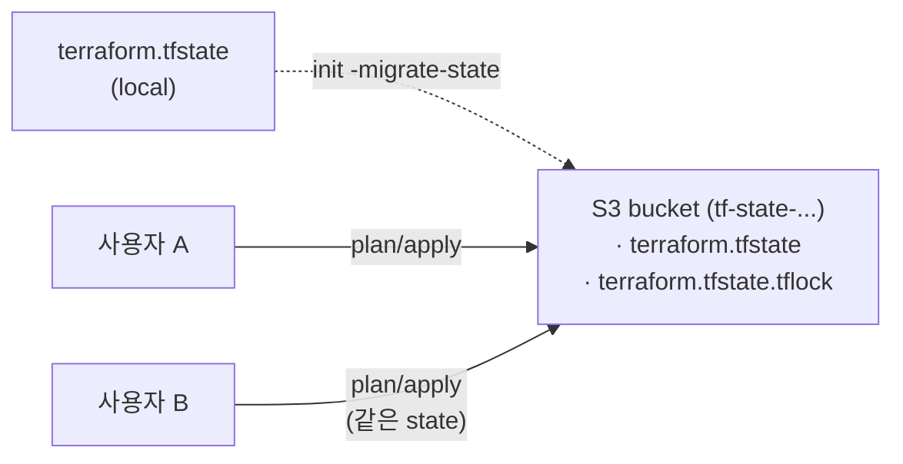

# 9. remote state

state 파일을 노트북 밖의 공용 저장소(S3) 로 옮기고, 동시 apply 를 막는 lock(S3 의 `.tflock` 파일) 까지 붙입니다. backend 인프라 자체를 무엇으로 만들 것인가의 **부트스트랩 문제** 도 함께 다룹니다.

## 핵심 다이어그램



- **`backend "s3"`** — state 파일을 S3 버킷에 두는 backend.
- **lock (`use_lockfile = true`)** — apply 중 같은 버킷에 `terraform.tfstate.tflock` 파일을 만들어 동시 apply 차단. S3 conditional write 로 원자적 획득.
- **부트스트랩 문제** — backend 인프라(S3) 도 IaC 로 짜고 싶지만, 그 자신의 backend 가 아직 없으니 어디서 시작해야 하는가.
- **`-migrate-state`** — 기존 state 파일을 새 backend 로 옮기는 init 옵션.

> 예전에는 DynamoDB 테이블을 lock 저장소로 같이 만들어 `dynamodb_table` 옵션으로 가리키는 패턴이 표준이었습니다. Terraform 1.10+ 부터 S3 자체의 conditional write 로 lock 을 처리할 수 있어 (`use_lockfile = true`), 추가 인프라 없이 끝납니다. 이 편에서는 신식 방법을 씁니다.

## 빠른 시작

```bash
mkdir -p /tmp/tf-lab-9 && cd /tmp/tf-lab-9
```

### Step 1 — local backend 로 state 버킷 만들기

```hcl
# main.tf
terraform {
  required_providers {
    aws = {
      source  = "hashicorp/aws"
      version = "~> 5.0"
    }
  }
}

provider "aws" {
  region  = "ap-northeast-2"
  profile = "rosa-lab"
}

data "aws_caller_identity" "current" {}

locals {
  prefix = "rosa-lab-tf-9"
  tags = {
    Project = "rosa-hands-on"
    Edition = "terraform-9"
  }
}

# ─── state 버킷 ─────────────────────
resource "aws_s3_bucket" "state" {
  bucket        = "${local.prefix}-state-${data.aws_caller_identity.current.account_id}"
  force_destroy = true
  tags          = local.tags
}

resource "aws_s3_bucket_versioning" "state" {
  bucket = aws_s3_bucket.state.id
  versioning_configuration {
    status = "Enabled"
  }
}

resource "aws_s3_bucket_server_side_encryption_configuration" "state" {
  bucket = aws_s3_bucket.state.id
  rule {
    apply_server_side_encryption_by_default {
      sse_algorithm = "AES256"
    }
  }
}

# state 가 우연히 public 으로 노출되지 않게 막기
resource "aws_s3_bucket_public_access_block" "state" {
  bucket                  = aws_s3_bucket.state.id
  block_public_acls       = true
  block_public_policy     = true
  ignore_public_acls      = true
  restrict_public_buckets = true
}

output "account_id" {
  value = data.aws_caller_identity.current.account_id
}

output "bucket" {
  value = aws_s3_bucket.state.id
}
```

```bash
terraform init
terraform apply
#   Enter a value: yes
# Apply complete! Resources: 4 added, 0 changed, 0 destroyed.
```

이 시점에 state 는 아직 노트북의 `terraform.tfstate`. 다음 단계에서 방금 만든 S3 버킷으로 옮깁니다.

### Step 2 — `backend "s3"` 추가 → `init -migrate-state`

main.tf 의 `terraform` 블록 안에 `backend "s3"` 블록을 추가합니다.

```hcl
terraform {
  required_providers {
    aws = {
      source  = "hashicorp/aws"
      version = "~> 5.0"
    }
  }

  backend "s3" {
    bucket       = "rosa-lab-tf-9-state-<ACCOUNT_ID>"
    key          = "terraform.tfstate"
    region       = "ap-northeast-2"
    profile      = "rosa-lab"
    use_lockfile = true
    encrypt      = true
  }
}
```

> backend 블록 안의 값은 **literal 만** 됩니다 — variable · locals · data 참조 불가. 미리 안 값을 그대로 적어 넣어야 합니다. (Step 1 의 output 으로 account_id 가 보입니다.)

```bash
terraform output -raw account_id
# 123456789012
# ↑ 이 값을 backend "s3" 블록의 bucket 자리에 박아 넣기
```

state 를 옮깁니다.

```bash
terraform init -migrate-state
# Initializing the backend...
# Terraform has detected that the configuration specified for the backend
# has changed. Terraform will now check for existing state...
#
# Do you want to copy existing state to the new backend?
#   Enter a value: yes
#
# Successfully configured the backend "s3"! Terraform will automatically
# use this backend unless the backend configuration changes.
```

확인:

```bash
ls -la terraform.tfstate*
# terraform.tfstate          ← 비어 있거나 minimal
# terraform.tfstate.backup   ← 이전 local state

aws s3 ls "s3://$(terraform output -raw bucket)/" --profile rosa-lab
# 2026-... terraform.tfstate
```

state 가 S3 로 올라갔습니다. 이제 plan/apply 는 S3 의 state 를 읽고 씁니다.

## 여기서 직접 확인할 수 있는 것

### lock 이 동시 apply 를 막습니다

apply 가 진행 중일 때 S3 버킷에 `terraform.tfstate.tflock` 파일이 생깁니다. 두 번째 apply 는 그 파일을 못 만들고(이미 존재) 거부됩니다.

```bash
# 터미널 A — apply 시작, confirm 직전에서 대기
terraform apply
#   Do you want to perform these actions?
#   Enter a value: ← 아직 누르지 않음

# 다른 셸에서 S3 의 lock 파일 확인
aws s3 ls "s3://$(terraform output -raw bucket)/" --profile rosa-lab
# 2026-... terraform.tfstate
# 2026-... terraform.tfstate.tflock   ← lock 파일

# 터미널 B — 같은 config 에서 동시 apply 시도
terraform apply
# Error: Error acquiring the state lock
#
# Lock Info:
#   ID:        ...
#   Path:      .../terraform.tfstate
#   Operation: OperationTypeApply
#   Who:       ...
#   Created:   ...
```

A 에서 apply 가 끝나거나 Ctrl-C 로 취소되면 `.tflock` 이 삭제되고 B 가 진행 가능.

> lock 이 비정상 종료로 남아 있다면 `terraform force-unlock <LOCK_ID>` 로 해제. 내부적으로 `.tflock` 파일을 지웁니다.

### state versioning — 잘못된 apply 의 복구

state 버킷에 versioning 을 켰으니, apply 한 번이 잘못돼도 직전 버전으로 되돌릴 수 있습니다.

```bash
aws s3api list-object-versions \
  --bucket $(terraform output -raw bucket) \
  --prefix terraform.tfstate \
  --query 'Versions[].{VersionId:VersionId,LastModified:LastModified}' \
  --profile rosa-lab
# [
#   { "VersionId": "abc...", "LastModified": "2026-... 14:30:00" },
#   { "VersionId": "def...", "LastModified": "2026-... 14:15:00" },
#   ...
# ]
```

이전 버전을 가져와 현재로 덮어쓰면 그 시점으로 state 가 되돌아갑니다. (직접 시연하지는 않지만, 운영에서 한 번쯤 쓸 일이 옵니다.)

### 부트스트랩 문제 — backend 인프라 자체를 무엇으로 만들까

backend 의 S3 도 IaC 로 짰지만, 그 인프라를 만들 때 쓰던 state 는 어디 두는가 — 이게 부트스트랩 문제입니다.

이 편에서 쓴 패턴은 **자기참조형 부트스트랩**:

1. local backend 로 한 번 apply → backend 인프라 생성 (Step 1)
2. backend 블록 추가 → `init -migrate-state` 로 state 를 자기가 만든 S3 로 옮김 (Step 2)
3. 이후 모든 apply 는 S3 backend

단점: backend 인프라를 destroy 하려면 state 를 먼저 local 로 빼내야 합니다 (자기 state 가 자기 안에 있으므로). 아래 destroy 절차 참고.

다른 패턴:

- **부트스트랩 전용 폴더** — `bootstrap/` 에서 local state 로 backend 인프라만 만들고, 그 state 는 손대지 않거나 별도 보관. 메인 코드는 처음부터 `backend "s3"` 로 시작. 단일 책임이라 운영에 더 적합.
- **수동 부트스트랩** — AWS 콘솔/CLI 로 S3 버킷을 한 번 만들어두고, Terraform 은 처음부터 `backend "s3"`. 가장 단순.

## destroy — backend 를 떼어내고 정리

backend 인프라를 그대로 destroy 하면 리소스(S3 버킷) 자체는 사라집니다. 다만 destroy 끝에 Terraform 이 마지막 state 를 backend(방금 지워진 S3) 에 쓰려다 실패해, `Failed to save state` · `Error releasing the state lock` 같은 에러가 쏟아지고 로컬에 `errored.tfstate` 가 안전망으로 남습니다.

학습 폴더를 통째로 지우면 흔적도 같이 사라지지만, 운영에서 같은 backend 가 다른 state 도 보관하는 상황이면 곤란해집니다. 안전한 역순은 state 를 먼저 local 로 끌어내린 뒤 destroy:

```bash
# Step A — backend "s3" 블록을 주석 처리하고 state 를 local 로 다시 가져옴
# main.tf 의 backend "s3" { ... } 를 주석 처리

terraform init -migrate-state
#   Do you want to copy existing state to the new backend?
#   Enter a value: yes
# (S3 의 state 가 local 로 돌아옴)

# Step B — destroy
terraform destroy
#   Enter a value: yes
# Destroy complete! Resources: 4 destroyed.
```

확인:

```bash
aws s3 ls --profile rosa-lab | grep rosa-lab-tf-9
# (없음)
```

### 실습 폴더 정리

```bash
cd ..
rm -rf /tmp/tf-lab-9
```
